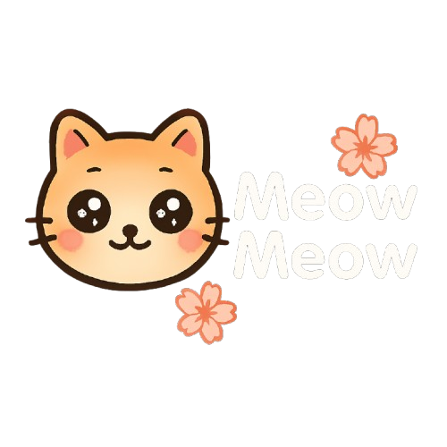
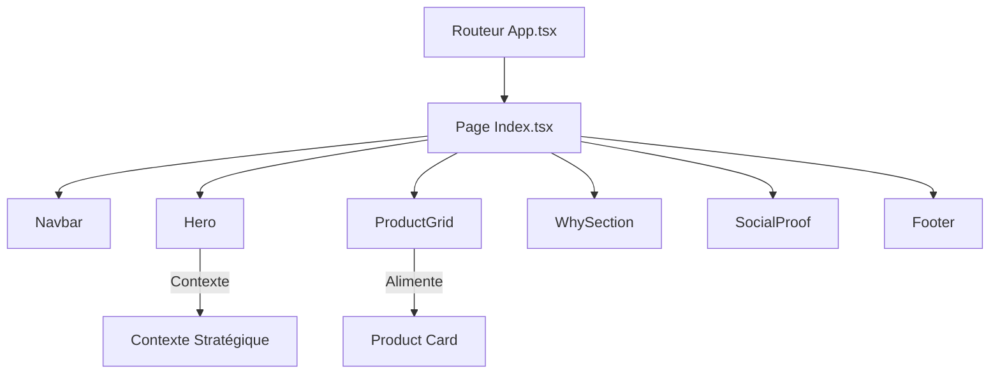

<!-- markdownlint-disable MD033 -->
<p align="center">
  
</p>

<p align="center">
  
  
  
  
</p>

<p align="center">
  
  
  
  
  
</p>
<!-- markdownlint-enable MD033 -->

Bienvenue dans le **manuel chronologique complet** du projet Meow Meow. Ce projet est une démonstration pratique de la façon dont un agent de développement IA (**Antigravity**) peut transformer une vision stratégique en une DNVB (Digital Native Vertical Brand) haut de gamme axée sur le design.

Meow Meow révolutionne le marché de l'alimentation pour animaux en associant la nutrition féline et le design d'intérieur — créant le premier produit alimentaire pour chats assez esthétique pour faire partie intégrante de la décoration d'une maison.

Tous les prompts, la stratégie et la documentation sont disponibles dans le dossier [**docs**](/docs).

---

> [!IMPORTANT]
> **Définition du périmètre du MVP (Minimum Viable Product)** : 
> - Section Hero axée sur le design avec un impact de marque immédiat.
> - Présentation de produits hautement esthétique (packaging design).
> - Récit de marque ciblé pour le parent d'animaux sensible au design (« The Aesthetic Cat Parent »).
> - Expérience mobile fluide optimisée pour le trafic issu des réseaux sociaux.
> - **Zéro** encombrement visuel pour préserver l'ambiance de décoration d'intérieur.

### Le Résultat Final
La mission : Transformer une vision stratégique en une page d'atterrissage (Landing Page) fonctionnelle de qualité industrielle.

<div align="center">
  
</div>

---
## I. Cadrage Stratégique

Chaque projet commence par une **intention** claire. Meow Meow n'est pas seulement un site web, c'est une révolution sur le marché de l'alimentation pour animaux. Nous avons refusé le statu quo du « sac de croquettes disgracieux » et défini une mission de marque axée sur le design grâce à notre [Brief Stratégique](docs/I.%20Strategic%20Framing/Strategy%20and%20Concept/Strategy%20and%20Concept.md).

### Étape 1.1 : Définition du concept de marque
Nous avons établi la stratégie principale pour positionner Meow Meow comme une marque d'alimentation esthétique pour animaux, comblant le fossé entre le soin des animaux et le design d'intérieur haut de gamme.

> **Extrait de la stratégie de marque :**
> *Objectif : Bousculer le marché avec des produits alimentaires esthétiques qui n'ont pas besoin d'être cachés dans un placard.*
> *Profil cible : Le parent de chat adepte du design (citadins de 25 à 35 ans, passionnés de décoration d'intérieur).*
> *Argument de vente unique (USP) : « Les premières croquettes aussi belles que votre décoration. »*

<div align="center">
  
</div>

### Étape 1.2 : Création de l'identité de marque
Une fois le concept validé, nous avons défini l'ADN visuel : un équilibre entre esthétique « Kawaii-Minimaliste » et haut de gamme pour créer une atmosphère chaleureuse et premium.

> **Extrait de l'identité de marque :**
> *Couleurs : Café au lait crémeux (#FDFCF0), Rose poudré (#F8D7DA), Terre cuite (#E07A5F).*
> *Typographie : M PLUS Rounded 1c (chaleureuse) & Inter (épurée).*
> *Ambiance : Douce, arrondie, chaleureuse et respirante.*

<div align="center">
  
</div>

### Étape 1.3 : Livrable de la synthèse stratégique
Toutes les recherches stratégiques — de la définition des cibles à l'ADN visuel — ont été synthétisées dans un plan directeur pour aligner la vision de la marque avant d'écrire le moindre code.

<div align="center">
  
</div>

---

## II. Collections Graphiques & Orchestration par l'IA

Pour éviter un rendu « générique » ou vide, nous avons orchestré un ensemble complet de ressources de marque à l'aide de modèles d'IA. Chaque visuel — de la bannière principale aux textures des packagings — a été généré conformément à la stratégie de produit esthétique pour animaux.

### Étape 2.1 : Le flux de rédaction de prompts
Nous n'avons pas seulement demandé de la « nourriture pour chat ». Nous avons fourni des règles de marque très précises à l'IA pour garantir que chaque pixel corresponde à l'ADN Japandi/Pastel.

<div align="center">
  
</div>

### Étape 2.2 : Galerie de ressources graphiques
Chaque image de ce projet est le résultat direct de prompts cliniques rédigés pour l'IA. Cliquez sur n'importe quelle vignette ci-dessous pour voir le **méga-prompt** utilisé pour la générer.

<div align="center">

| [**Bannière Hero**](docs/II.%20Graphic%20Collections/Prompts/Prompt%20%E2%80%94%20hero-banner.md) | [**Style de vie Cosy**](docs/II.%20Graphic%20Collections/Prompts/Prompt%20%E2%80%94%20lifestyle-cosy.md) | [**Texture Macro**](docs/II.%20Graphic%20Collections/Prompts/Prompt%20%E2%80%94%20macro-croquettes.md) | [**Packaging Principal**](docs/II.%20Graphic%20Collections/Prompts/Prompt%20%E2%80%94%20packaging-front.md) |
|---|---|---|---|
|  |  |  |  |
| [**Saveur Saumon**](docs/II.%20Graphic%20Collections/Prompts/Prompt%20%E2%80%94%20packaging-saumon.md) | [**Mélange de Vitamines**](docs/II.%20Graphic%20Collections/Prompts/Prompt%20%E2%80%94%20packaging-vitamines.md) | [**Preuve Sociale I**](docs/II.%20Graphic%20Collections/Prompts/Prompt%20%E2%80%94%20social-proof-chat-dormant.md) | [**Preuve Sociale II**](docs/II.%20Graphic%20Collections/Prompts/Prompt%20%E2%80%94%20social-proof-selfie.md) |
|  |  |  |  |

</div>

### Étape 2.3 : Rendu graphique final
L'aboutissement de cette phase est une bibliothèque visuelle complète prête à être injectée dans l'environnement frontend.

<div align="center">
  
</div>

---

## III. Intégration & Ingénierie de Contexte

Le passage du design stratégique à l'exécution technique nécessite une phase d'intégration rigoureuse. Nous avons utilisé **Lovable** comme environnement principal pour faire la liaison entre la conception IA et le code prêt pour la production.

### Étape 3.1 : Démarrage du projet
Nous avons initialisé l'environnement du projet, en veillant à ce que toute la structure initiale réponde bien aux exigences d'une DNVB haut de gamme.

<div align="center">
  
  
</div>

### Étape 3.2 : Ingénierie de contexte
L'IA dépend de la pertinence du contexte qu'elle reçoit. Après la création du compte, nous avons procédé à une phase complète d'**Ingénierie de Contexte** : chargement de nos prompts système, de notre architecture, du [Prompt d'ADN de la marque](<docs/IV. Context Engineering/Prompt - Context Engineering.md>) et de toutes les ressources graphiques créées par l'IA.

<div align="center">
  
</div>

### Étape 3.3 : Étalonnage du système de design (Design System)
Avant d'écrire la moindre ligne de code pour les composants, nous avons utilisé la préconfiguration de Lovable pour poser les bases. We manually calibrated the theme to match our established HEX codes and typography.

---

<div align="center">
  
</div>

<div align="center">

| **Couleurs personnalisées** | **Effets graphiques** | **Typographie** |
|---|---|---|
|  |  |  |

</div>

---

## IV. Vibe-coding & Assemblage

Une fois le contexte établi et les jetons de design étalonnés, nous avons lancé le **Vibecoding**. Cette phase se caractérise par un échange rapide avec le modèle d'IA pour affiner les composants et les mises en page en temps réel.

> **Prompt d'Orchestration Stratégique (Entrée IA) :**
> *"Act as a Senior Frontend Specialist. Implement a high-end, design-first Landing Page for 'Meow Meow'. Use React with Vite and Tailwind CSS. Prioritize a 'Kawaii-Minimalist' aesthetic with soft pastel tones. Every component must be atomized and use Framer Motion for premium micro-animations."*

---

### Étape 4.1 : Structure de l'arborescence
L'agent génère l'arborescence propre et atomique du projet, en respectant une séparation stricte entre les pages, les composants et les styles globaux.

```text
landing-page/
├── docs/            # Fondations stratégiques
├── frontend/        # Application technique
│   ├── src/         # Composants et pages React
│   ├── public/      # Ressources visuelles statiques
│   ├── vite.config.ts
│   └── package.json
├── README.md
└── package.json     # Workspace unifié (Monorepo)
```

---

### Étape 4.2 : Hiérarchie des composants & Flux logique
La page d'atterrissage repose sur une hiérarchie modulaire où l'association des ressources stratégiques s'effectue au niveau des composants.



---

### Étape 4.3 : Production rapide de code
Nous avons fourni la logique d'orchestration à Lovable, qui a commencé à générer les composants React, les styles Tailwind et les micro-animations avec Framer Motion.

<div align="center">
  
</div>

#### **Fichier de Code A : Routage sémantique ([frontend/src/App.tsx](frontend/src/App.tsx))**
Un routeur propre et centralisé gérant la vue principale et une page 404 de secours.
```tsx
const App = () => (
  <QueryClientProvider client={queryClient}>
    <TooltipProvider>
      <BrowserRouter>
        <Routes>
          <Route path="/" element={<Index />} />
          <Route path="*" element={<NotFound />} />
        </Routes>
      </BrowserRouter>
    </TooltipProvider>
  </QueryClientProvider>
);
```

#### **Fichier de Code B : Orchestration de la page ([frontend/src/pages/Index.tsx](frontend/src/pages/Index.tsx))**
Le fichier principal d'assemblage qui lie les composants pour structurer l'expérience globale de la marque.
```tsx
const Index = () => {
  return (
    <div className="min-h-screen bg-background">
      <Navbar />
      <main>
        <Hero />
        <ProductGrid />
        <WhySection />
        <SocialProof />
      </main>
      <Footer />
    </div>
  );
};
```

---

## V. Déploiement & Suivi

Une page d'atterrissage n'a de valeur que si elle est accessible et performante. Nous avons exploité les capacités de déploiement de Lovable pour passer de la compilation à la mise en ligne en quelques secondes.

### Étape 5.1 : Publication instantanée
Pour le prototypage rapide, nous avons utilisé la fonction de publication en un clic pour déployer le site sur un CDN mondial sous un sous-domaine généré.

<div align="center">
  
</div>

### Étape 5.2 : Flux professionnel (GitHub & Vercel)
Pour une configuration de production robuste, nous avons opté pour le flux de travail classique **GitHub + Vercel**. Cela offre un meilleur contrôle des versions, des domaines personnalisés et des performances optimales.

1.  **Export GitHub** : Nous avons choisi l'option d'exportation vers GitHub pour créer un dépôt dédié.
2.  **Duplication du dépôt** : Nous avons synchronisé la base de code sur un dépôt indépendant.
3.  **Connexion Vercel** : Nous avons lié le nouveau dépôt à Vercel pour automatiser le déploiement continu (CI/CD).

**Commandes (premier push depuis le local) :**

```bash
git init
git remote add origin git@github.com:USERNAME/landing-page.git
git add .
git commit -m 'my first commit'
git push -u origin main
```

<div align="center">

| **1. Export Lovable GitHub** | **2. Configuration du dépôt** |
|---|---|
|  |  |

</div>

<div align="center">
  
</div>

### Étape 5.3 : Suivi de la production & Monitoring
La page d'atterrissage **Meow Meow** est désormais officiellement en ligne. Nous avons accès à une suite de suivi professionnelle pour observer l'engagement des visiteurs tout en validant le rendu de notre création.

<div align="center">
  
</div>

---

## 🏆 Mission Accomplie !

Félicitations ! Le projet **Meow Meow** est entièrement opérationnel et prêt pour la production.

**Démos en ligne** : [**meow-meow-lover.lovable.app**](https://meow-meow-lover.lovable.app/#) (Maquette Lovable) | [**landing-page-orpin-eta-53.vercel.app**](https://landing-page-orpin-eta-53.vercel.app/) (Production Vercel)

*Ce cours illustre la puissance du développement orchestré par IA. Du cadrage stratégique à la mise en production, vous avez franchi toutes les étapes de ce flux de travail assisté.*

<div align="center">
  
</div>
